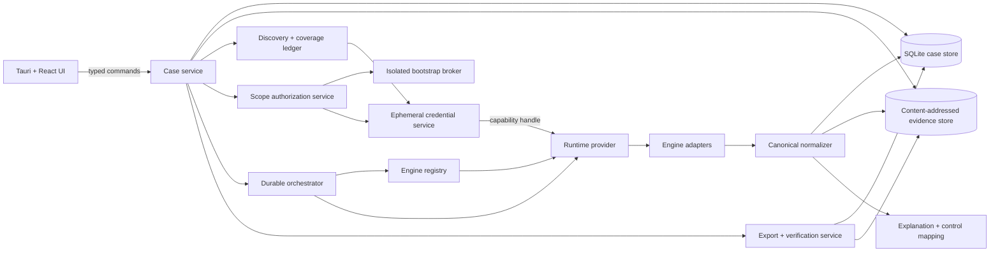

# ai-security-scanner architecture

Status: implementation architecture

Last updated: 2026-08-24

This document describes the target architecture. Component names and interfaces are requirements or proposed contracts until corresponding code and tests exist; they are not implementation claims.

## 1. Architectural goals

The architecture must support a local, durable, repeatable assessment case across many independently maintained scanners while preserving four invariants:

1. High-privilege bootstrap credentials never reach scanner engines.
2. A failed or omitted scan never becomes a passing result.
3. Normalization never destroys the original evidence.
4. A later run can explain whether a difference came from the environment, scope, engine, rules, or adapter.

## 2. System overview



The UI never talks directly to a container runtime, credential broker, engine process, or evidence file. All privileged actions cross a narrow typed command boundary implemented by the Tauri backend.

## 3. Process and trust boundaries

### 3.1 Desktop UI

The React application renders the six product views and submits typed commands. It is unprivileged and must not receive raw credentials or a Docker/Podman socket.

### 3.2 Tauri case service

The Rust backend owns case state, persistence, authorization decisions, orchestration, redaction, and export. Frontend validation is usability only; backend validation is authoritative.

### 3.3 Bootstrap broker

The broker is a separate, minimal process used only when the user cannot establish provider-native read-only authorization directly. It exchanges a high-privilege login for a dedicated short-lived read-only scan role, verifies that role, transfers only a capability handle for the read-only role, and exits.

It must not load third-party adapters, call the container runtime, accept arbitrary commands, persist secrets, write secrets to logs, or expose a general network proxy. Detailed requirements are in [threat-model.md](threat-model.md).

### 3.4 Runtime provider

The runtime provider is the only backend component that controls engine processes or containers. It exposes a constrained job API, not a raw daemon socket.

Required providers are:

- `managed_local`: the zero-engine-install user experience required for supported desktop releases;
- `docker`: compatibility and development provider for an existing Docker Engine;
- `podman`: compatibility and development provider for an existing Podman installation.

The managed provider may use a legally redistributable container stack or platform VM internally. “Bundle Docker” is a user-experience requirement, not permission to redistribute Docker Desktop. The chosen implementation must be recorded per supported operating system and architecture.

### 3.5 Engine process

Every third-party engine executes out of process through an adapter. It receives only the inputs, read-only credentials, mounts, target allowlist, and network destinations declared in its manifest and approved scan contract.

## 4. Suggested repository boundaries

The implementation should preserve these logical boundaries even if the final package layout differs:

```text
src/                         React application
src-tauri/                   Rust desktop backend and typed IPC
crates/case-domain/          domain types and state transitions
crates/case-store/           SQLite and evidence blob storage
crates/credential-service/   capability handles and provider auth
crates/bootstrap-broker/     isolated administrative bootstrap binary
crates/engine-registry/      manifests, compatibility, and license metadata
crates/orchestrator/         durable engine job state machine
crates/runtime/              managed, Docker, and Podman providers
crates/adapters/             adapter protocol and built-in adapters
crates/normalization/        canonical model and exporters
crates/case-export/          package, redaction, hash, and verification
engines/                     declarative manifests and adapter fixtures
mappings/                    versioned NIST/ISO relationships
skills/                      Claude/Codex setup and operations guidance
```

Third-party source checkouts used for research are not runtime imports and must not be compiled into the application merely because they exist in the workspace.

## 5. Domain model

Identifiers are opaque UUIDs except where a stable content-derived identifier is explicitly required. Timestamps use UTC RFC 3339. Serialized structures include a `schema_version`.

### 5.1 AssessmentCase

```text
AssessmentCase
  id
  name
  created_at
  updated_at
  status: draft | discovering | ready | running | partial | completed | archived
  assessment_profile
  data_source_ids[]
  selected_baseline_run_id?
  provenance: user | demo
```

`completed` means a particular case run reached its terminal state. It is not a claim that the product, organization, or security assessment is complete.

### 5.2 DataSource

```text
DataSource
  id
  case_id
  kind: aws | azure | gcp | m365 | dns | ct_log | git | terraform | kubernetes | billing | local
  status: disconnected | connecting | connected | degraded | expired | failed
  non_secret_metadata
  credential_capability_id?   # memory-only; never serialized or exported
  last_inventory_at?
```

Serialized `DataSource` objects never contain tokens, passwords, keys, cookies, or provider CLI caches.

### 5.3 Asset

```text
Asset
  id
  case_id
  stable_key
  kind
  provider
  provider_account_or_tenant?
  native_id
  region_or_location?
  display_name
  attributes
  discovered_from[]
  ownership_state: candidate | confirmed | rejected | unknown
  first_seen_at
  last_seen_at
```

The stable key is derived from provider namespace, account or tenant, region where material, asset kind, and provider-native identifier. Display names, IP addresses, and mutable tags alone are not stable identity.

### 5.4 ScopeGrant

```text
ScopeGrant
  id
  case_id
  asset_selector
  activity: inventory | configuration_read | local_analysis | passive_public_discovery |
            low_impact_external | active_external
  asserted_authority
  acknowledgment_text_version
  approved_at
  expires_at?
  revoked_at?
```

The backend resolves the selector to concrete targets before a run and stores that resolved set with the run. A later asset discovered under the same wildcard is not silently added to a completed run.

### 5.5 CoverageRecord

```text
CoverageRecord
  id
  case_id
  run_id?
  subject_kind: environment | data_source | asset | control_area
  subject_id
  state: discovered_authorized_scanned |
         discovered_not_authorized |
         authorized_scan_incomplete |
         source_connected_no_asset_discovered |
         source_not_connected_unknown |
         not_applicable
  reason_code
  evidence_ids[]
  updated_at
```

Coverage is stored independently from findings. Zero findings cannot manufacture a coverage record.

### 5.6 EngineManifest and EngineRun

```text
EngineRun
  id
  case_id
  scan_run_id
  engine_id
  manifest_version
  engine_version
  artifact_digest
  ruleset_versions{}
  vulnerability_database_versions{}
  adapter_version
  state: pending | running | completed | partial | failed | not_executed | cancelled
  checkpoint
  resolved_targets[]
  started_at?
  finished_at?
  error?
```

### 5.7 Finding and Evidence

```text
Finding
  id
  case_id
  scan_run_id
  stable_fingerprint
  asset_id
  category
  title
  source_severity
  normalized_severity
  confidence
  verification_state
  priority_bucket: prioritize | needs_confirmation | observe
  workflow_state
  plain_language_risk
  possible_impact
  suggested_next_step
  recommended_expert_type
  source_refs[]
  related_control_mappings[]
  related_finding_ids[]
  evidence_ids[]
```

```text
Evidence
  id
  finding_id?
  asset_id?
  engine_run_id
  media_type
  sha256
  sensitivity
  captured_at
  blob_ref
  source_locator
```

The stable fingerprint is adapter-versioned. It should combine engine-independent problem identity, stable asset identity, and material location while excluding volatile prose and timestamps. A fingerprint change must be explainable during re-verification.

Related findings are grouped, not discarded. The original one-to-one mapping between engine output and evidence remains reconstructable.

### 5.8 ControlMapping

```text
ControlMapping
  id
  finding_category
  framework: nist_csf | iso_27001
  framework_version
  control_id
  relationship: related | supporting_evidence | partial_signal
  rationale
  mapping_version
  reviewed_by
  reviewed_at
```

There is deliberately no `pass`, `fail`, or compliance score field.

### 5.9 VerificationDiff

```text
VerificationDiff
  id
  baseline_run_id
  comparison_run_id
  baseline_finding_id?
  comparison_finding_id?
  state: resolved | persistent | new | unverifiable
  evidence_changed
  explanation
```

An evidence or severity change on a reproduced issue is represented as `persistent` with `evidence_changed: true`; it is not a fifth top-level state.

## 6. Local persistence

### 6.1 Case database

Use SQLite in WAL mode for case metadata, durable job state, manifests resolved for a run, coverage, assets, findings, mappings, and workflow history. Migrations are transactional and versioned.

### 6.2 Evidence store

Raw output and evidence live in a case-scoped content-addressed store keyed by SHA-256. Database rows reference blobs; adapters never return arbitrary host paths to the UI.

Writes use a temporary file in the destination filesystem, verify length and hash, then atomically rename. Import and extraction reject absolute paths, parent traversal, symlinks that escape the case root, and device files.

### 6.3 Secrets

Secrets do not enter SQLite or the evidence store. An ephemeral credential service stores them in process memory and issues opaque, short-lived capability handles scoped to provider, engine, targets, and expiry.

If an operating system or provider forces a disk-backed cache, that integration is not compliant until it has an explicit threat review, encrypted storage design, expiration, deletion verification, and user-visible disclosure.

## 7. Tauri command contract

The command boundary uses versioned request and response structures. Errors are typed as `validation`, `authorization`, `not_found`, `conflict`, `runtime_unavailable`, `engine_failure`, `storage`, `cancelled`, or `internal`, with a redacted user message and a stable diagnostic code.

The initial command surface is:

| Command | Purpose |
|---|---|
| `get_app_snapshot` | Return selected case, summaries, coverage, current run, findings summary, and runtime health. |
| `create_case` | Create a real user case from validated assessment input. |
| `select_case` | Select and load a case by identifier. |
| `seed_demo_case` | Create explicitly marked synthetic data for development or demonstration. It must never look like a real scan. |
| `list_engine_manifests` | Return installed/available engines, versions, licensing disposition, runtime needs, and implementation status. |
| `start_discovery` | Start attributable candidate-asset discovery for a case. |
| `approve_scope` | Store explicit scope grants and the resolved targets or selectors. |
| `start_scan` | Validate grants, freeze a run plan, and start applicable engines. |
| `pause_scan` | Request a safe checkpoint and pause where supported. |
| `resume_scan` | Resume a paused or recoverable run. |
| `cancel_scan` | Cancel remaining work and perform credential/container cleanup. |
| `export_case` | Create an explicit, optionally redacted portable package. |
| `verify_case_export` | Recompute package hashes and signature integrity without asserting result correctness. |
| `start_rescan` | Create a new run from an existing case and selected baseline. |

Finding disposition and source-connection mutations require additional typed commands before those UI controls may be described as functional. They must not be simulated as successful frontend-only state.

### 7.1 Events

Long-running work emits versioned events:

- `case://coverage-changed`;
- `scan://run-progress`;
- `scan://engine-state`;
- `scan://finding-batch`;
- `scan://run-finished`;
- `export://progress`.

Every event contains `case_id`, relevant run ID, a monotonic sequence number, and a timestamp. The frontend treats events as hints and refreshes from `get_app_snapshot` after reconnect; it does not treat a missing event as durable state.

## 8. Engine registry

Each engine has a declarative, reviewable manifest. A minimum manifest contains:

```yaml
schema_version: 1
id: string
display_name: string
upstream:
  repository: https://github.com/owner/repo
  license_spdx: string
  license_review: pending | approved_for_download | approved_for_redistribution | blocked
artifact:
  mode: bundled | on_demand | host_binary
  version: string
  digest: sha256:...
  signature_policy: string
adapter:
  protocol_version: string
  version: string
capabilities: []
credential_profiles: []
target_kinds: []
network_allowlist: []
mounts: []
resource_limits: {}
rulesets: []
output_contract: string
support:
  platforms: []
  architectures: []
  knowledge_date: string
  support_until: string
```

An entry without a license disposition or artifact digest may be retained for research but cannot enter a release plan as a distributable engine.

The catalog and current research status are in [engine-catalog.md](engine-catalog.md). License obligations are summarized in [../THIRD_PARTY.md](../THIRD_PARTY.md).

## 9. Adapter protocol

Adapters are narrow translators around unmodified upstream CLIs or containers. The orchestrator passes an immutable run plan and a writable job directory. The adapter emits newline-delimited protocol messages:

```text
hello          protocol and adapter version
progress       bounded progress and checkpoint
raw_artifact   path within the job directory, media type, sensitivity
asset          canonical candidate or observed asset
finding        normalized finding plus source locator
coverage       what was attempted and with what result
diagnostic     redacted warning or error
complete       terminal counts and status
```

The backend validates message size, schema, identifiers, paths, and enum values. Untrusted engine text is data, never a shell fragment, HTML string, SQL fragment, or file path authority.

Adapters must not:

- make undeclared network calls;
- widen targets;
- request credentials outside their manifest profile;
- map engine failure to zero findings;
- suppress raw output because normalization failed;
- invent NIST or ISO mappings with an unreviewed language-model response.

## 10. Orchestration and recovery

A scan run freezes:

- the assessment case revision;
- resolved asset set and grants;
- selected engines and manifests;
- artifact and ruleset versions;
- runtime provider;
- adapter versions;
- mapping and explanation versions.

The durable orchestrator schedules independent engine jobs with resource limits. Checkpoints are persisted after state changes and bounded result batches.

Pause is cooperative. Cancel sends a graceful request, waits a bounded interval, terminates remaining engine processes, revokes capability handles, and asks the runtime provider to remove job containers and mounts. A cleanup failure becomes a visible diagnostic and retryable cleanup task.

Rate-limited cloud APIs use bounded exponential backoff and provider hints. A rate limit may yield `partial`; it does not silently retry forever.

## 11. Runtime isolation

Default engine isolation requirements are:

- pinned artifact digest; never an unqualified tag;
- read-only root filesystem when the engine permits it;
- non-root user when the engine permits it;
- no privileged mode;
- no host PID, IPC, or network namespace;
- no Docker or Podman socket mount;
- no broad home-directory mount;
- read-only inputs and a dedicated writable job directory;
- per-engine CPU, memory, process, storage, and duration limits;
- an explicit outbound network policy;
- environment variables generated by the backend, not interpolated through a shell command;
- teardown and orphan reconciliation on the next application start.

An engine requiring a weaker boundary must declare the exception and remain blocked from release until reviewed.

## 12. Discovery and scope planning

Discovery produces candidates plus provenance. It does not produce permission.

The plan builder intersects:

```text
connected source visibility
∩ confirmed assets
∩ active scope grants
∩ engine capabilities
∩ credential capability
∩ platform/runtime availability
= frozen engine run plan
```

The plan records why an engine was included or excluded. Exclusion contributes to coverage, not a pass result.

Public-data-only discovery and direct network contact are separate capabilities. DNS and certificate transparency queries may be permitted without contacting a target; port probing, header retrieval, and vulnerability templates require the corresponding direct-contact grant.

## 13. Normalization and schema exporters

The canonical model is the source of truth because the product requires case, scope, coverage, asset relationship, evidence, workflow, and re-verification semantics that do not map losslessly to one external standard.

- An OCSF exporter emits compatible finding and evidence fields where defined.
- An OSCAL exporter emits appropriate assessment and control-related data for exchange.
- The raw engine artifact remains available even when neither exporter can represent a field.

Exporters are versioned and must disclose omitted or extension fields. OCSF and OSCAL are interoperability formats, not product database schemas and not evidence that a formal audit occurred.

## 14. Prioritization and grouping

Prioritization may consider:

- externally reachable evidence;
- high-privilege identity impact;
- known practical exploitability;
- asset and data sensitivity, including PII/PHI context;
- likely blast radius;
- confidence and corroboration;
- remediation disruption.

The explanation stores the factors, not only a mysterious score. The UI may avoid exposing a numeric priority entirely.

Grouping joins related findings under a user-facing issue while retaining all source findings and evidence. Cross-engine corroboration raises confidence or priority; it does not duplicate a control failure or erase distinct technical problems.

## 15. Export package

A package is a deterministic archive with a versioned manifest:

```text
manifest.json
case.json
scope.json
coverage.json
assets.json
findings.json
runs.json
mappings.json
evidence/<sha256>
reports/summary.html
reports/summary.pdf          # when deterministic PDF generation is available
integrity/hashes.json
integrity/signature.json     # optional local key
licenses/
```

The manifest lists redactions and excluded blobs. Verification checks archive structure, hashes, and signature consistency. It returns `integrity_valid`, `integrity_invalid`, or `unverifiable`; it never returns “scan valid.”

## 16. Re-verification comparability

A baseline and candidate run are comparable at finding level only when:

- the stable asset identity is still resolvable;
- the relevant scope was granted in both runs;
- the responsible engine reached a sufficient terminal state in both runs;
- fingerprint migrations are defined when adapters changed;
- material rule changes are disclosed.

If those conditions fail, the result is `unverifiable`, not `resolved`.

Differences caused by an engine, ruleset, mapping, or adapter update are labeled separately from observed environment changes wherever the evidence permits.

## 17. Demo data

Synthetic cases are permitted for development and onboarding only. `seed_demo_case` must set `provenance: demo`, use obviously synthetic assets and evidence, and display a persistent Demo badge. Demo data must not be exportable without a conspicuous synthetic-data marker and must never be counted as proof that an engine integration works.

## 18. Repository skills boundary

Claude/Codex skills call documented application or maintenance commands. They may inspect manifests, runtime health, job state, and cleanup state. They do not receive secret values, bypass `approve_scope`, connect directly to the runtime socket, execute remediation, or turn a demo result into a real result.

## 19. Architectural acceptance conditions

The architecture is implemented only when evidence demonstrates:

- UI-to-backend commands are typed and backend-authorized;
- case and job state survives process restarts;
- credential capability handles cannot be resolved by the UI or unrelated engines;
- runtime providers enforce target, mount, network, and resource restrictions;
- adapter failure cannot create green coverage;
- raw evidence is immutable and hash-addressed;
- exporters disclose loss or extension fields;
- export verification distinguishes integrity from correctness;
- re-verification does not mark an unrun check as resolved;
- demo provenance cannot be confused with a real case.
