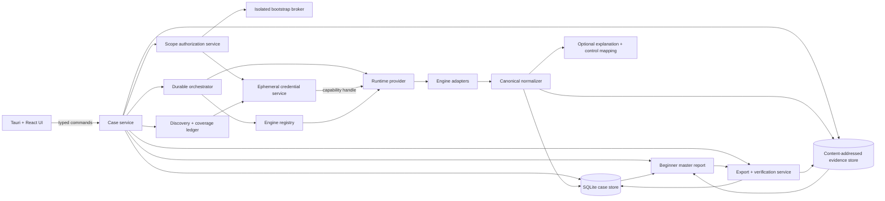

# ai-security-scanner architecture

Status: implementation architecture

Last updated: 2026-08-30

Normative status: this is a subordinate implementation reference. The [canonical product specification](product-spec.md) controls user-visible behavior and acceptance. Any conflict in views, gates, runtime readiness, recovery, or delivery order is a current implementation/design gap, not an additional product requirement.

This document describes the target architecture. Component names and interfaces are requirements or proposed contracts until corresponding code and tests exist; they are not implementation claims.

## 1. Architectural goals

The architecture must support a beginner reaching a durable result quickly across independently maintained scanners while preserving these invariants:

1. The main workspace and saved reports remain available while disposable runtime work is prepared or repaired.
2. A run and its known target-stage-engine tasks are persisted before runtime, gateway, image, or credential preflight.
3. Independent work fails independently and every run produces the same complete, partial, or no-checks master-report shape.
4. High-privilege bootstrap credentials never reach scanner engines.
5. A failed or omitted scan never becomes a passing result, and requested scope is never silently narrowed.
6. Normalization never destroys the original evidence.
7. A later run can explain whether a difference came from the environment, scope, engine, rules, or adapter.

## 2. System overview



The UI never talks directly to a container runtime, credential broker, engine process, or evidence file. All privileged actions cross a narrow typed command boundary implemented by the Tauri backend.

## 3. Process and trust boundaries

### 3.1 Desktop UI

The React application renders the four primary destinations—**New scan**, **Projects**, **Report**, and **Settings**—and contextual project states. It is unprivileged and must not receive raw credentials or a Docker/Podman socket. Setup, progress, comparison, export, engine detail, and cloud/provider configuration are contextual or Advanced surfaces, not additional primary destinations.

### 3.2 Tauri case service

The Rust backend owns case state, persistence, authorization decisions, orchestration, redaction, and export. Frontend validation is usability only; backend validation is authoritative.

### 3.3 Bootstrap broker

The broker is an Advanced cloud-only, separate minimal process used only when the user cannot establish provider-native read-only authorization directly. It exchanges a high-privilege login for a dedicated short-lived read-only scan role, verifies that role, transfers only a capability handle for the read-only role, and exits. Its absence or failure cannot appear in or block localhost, website, public/internal network, local source, project/report, or unsigned-export paths.

It must not load third-party adapters, call the container runtime, accept arbitrary commands, persist secrets, write secrets to logs, or expose a general network proxy. Detailed requirements are in [threat-model.md](threat-model.md).

### 3.4 Runtime provider

The runtime provider is the only backend component that controls engine processes or containers. It exposes a constrained job API, not a raw daemon socket.

Supported provider implementations are:

- `managed_local`: the background-prepared, zero-engine-install path for supported desktop releases;
- `docker`: an Advanced compatibility and development provider for an existing Docker Engine;
- `podman`: an Advanced compatibility and development provider for an existing Podman installation.

Runtime availability is evaluated per target-stage-engine task or genuine shared dependency group. Failure of one provider disables only dependent work after bounded automatic reconciliation; it never hides the workspace, discards the run, or prevents an honest master report.

The managed provider may use a legally redistributable container stack or platform VM internally. “Bundle Docker” is a user-experience requirement, not permission to redistribute Docker Desktop. The chosen implementation must be recorded per supported operating system and architecture.

### 3.5 Engine process

Every third-party engine executes out of process through an adapter. It receives only the inputs, read-only credentials, mounts, target allowlist, and network destinations declared in its manifest and approved scan contract.

## 4. Suggested repository boundaries

The implementation should preserve these logical boundaries even if the final package layout differs:

```text
src/                         React application
src-tauri/                   Rust desktop backend and typed IPC
crates/case-domain/          domain types and state transitions
crates/case-store/           SQLite and evidence blob storage
crates/credential-service/   capability handles and provider auth
crates/bootstrap-broker/     isolated administrative bootstrap binary
crates/engine-registry/      manifests, compatibility, and license metadata
crates/orchestrator/         durable engine job state machine
crates/runtime/              managed, Docker, and Podman providers
crates/adapters/             adapter protocol and built-in adapters
crates/normalization/        canonical model and exporters
crates/case-export/          package, redaction, hash, and verification
engines/                     declarative manifests and adapter fixtures
mappings/                    versioned NIST/ISO/AIDEFEND relationships
.codex/skills/, .claude/skills/  Codex/Claude setup and operations guidance
```

Third-party source checkouts used for research are not runtime imports and must not be compiled into the application merely because they exist in the workspace.

## 5. Domain model

Identifiers are opaque UUIDs except where a stable content-derived identifier is explicitly required. Timestamps use UTC RFC 3339. Serialized structures include a `schema_version`.

### 5.1 AssessmentCase

```text
AssessmentCase
  id
  name
  created_at
  updated_at
  assessment_profile
  data_source_ids[]
  selected_baseline_run_id?
  provenance: user | demo
```

Project status is a read-time projection of its selected run and durable task outcomes; it is not a
second persisted lifecycle or a readiness input. Legacy rows may retain a case-status compatibility
field while migration is pending, but the backend and UI must ignore it when deciding whether work
can start, whether coverage is complete, or whether a report is final.

### 5.2 DataSource

```text
DataSource
  id
  case_id
  kind: aws | azure | gcp | m365 | dns | ct_log | git | terraform | kubernetes | billing | local
  status: disconnected | connecting | connected | degraded | expired | failed
  non_secret_metadata
  credential_capability_id?   # memory-only; never serialized or exported
  last_inventory_at?
```

Serialized `DataSource` objects never contain tokens, passwords, keys, cookies, or provider CLI caches.

### 5.3 Asset

```text
Asset
  id
  case_id
  stable_key
  kind
  provider
  provider_account_or_tenant?
  native_id
  region_or_location?
  display_name
  attributes
  discovered_from[]
  ownership_state: candidate | confirmed | rejected | unknown
  first_seen_at
  last_seen_at
```

The stable key is derived from provider namespace, account or tenant, region where material, asset kind, and provider-native identifier. Display names, IP addresses, and mutable tags alone are not stable identity.

### 5.4 ScopeGrant

```text
ScopeGrant
  id
  case_id
  asset_selector
  activity: inventory | configuration_read | local_analysis | passive_public_discovery |
            low_impact_external | active_external
  asserted_authority
  acknowledgment_text_version
  approved_at
  expires_at?
  revoked_at?
```

The combined Start action records the applicable assertion together with the exact target and activity; it does not lead to a second permission screen. The backend resolves the selector to concrete targets and freezes the requested contract before contact. A later asset discovered under the same wildcard is not silently added to that run. Selecting materially deeper, more active, or wider work creates a linked child run with its own grant rather than mutating an active run.

### 5.5 CoverageRecord

```text
CoverageRecord
  id
  case_id
  run_id?
  subject_kind: environment | data_source | asset
  subject_id
  state: discovered_authorized_scanned |
         discovered_not_authorized |
         authorized_scan_incomplete |
         source_connected_no_asset_discovered |
         source_not_connected_unknown |
         not_applicable
  reason_code
  evidence_ids[]
  updated_at
```

Coverage is stored independently from findings. Zero findings cannot manufacture a coverage record.
Questionnaire applicability is equally explicit: selected environment families begin as unknown until a bounded source is connected, while excluded families retain a reasoned `not_applicable` record. `not_applicable` is a scoping statement and is never rendered as scanned/green. User-entered domains, addresses, repositories, IaC projects, exact image digests, and Kubernetes context names enter through an attributable `user_declared` source as untrusted candidates. Questionnaire assessment activities are persisted separately from permissions and can never create a scope grant.

### 5.6 ScanRun, ScanTask, and EngineRun

```text
ScanRun
  id
  case_id
  requested_coverage_contract       # frozen before target contact
  executed_coverage                 # append-only until terminal, then immutable
  state: queued | running | complete | partial | no_checks_completed | cancelled
  created_at
  terminal_at?

ScanTask
  id
  scan_run_id
  target_id
  stage: quick_discovery | full_inventory | deep_check
  engine_id
  attempt_ids[]
  outcome: tested_complete | tested_partial | failed | timed_out | cancelled | not_tested
  outcome_reason?
  last_heartbeat_at?
  deadline_at?
```

The run and all tasks known at planning time are committed before disposable runtime, gateway, image, credential, or engine preflight. Those checks update only the affected task or genuinely shared task group. One task failure never rolls back a sibling's evidence. Per-host, port, page, repository, or batch work that can survive independently is represented as a task or append-only subtask rather than one transactional engine output file.

`no_checks_completed` is an honest report outcome, not a first-value success. Every run exposes one beginner master report containing frozen requested scope, append-only executed scope, tested/not-tested/failed coverage, findings, next steps, and collapsed technical evidence.

### 5.7 EngineManifest and EngineRun

```text
EngineRun
  id
  case_id
  scan_run_id
  engine_id
  manifest_version
  engine_version
  artifact_digest
  ruleset_versions{}
  vulnerability_database_versions{}
  adapter_version
  state: pending | running | completed | partial | failed | timed_out | not_executed | cancelled
  checkpoint
  resolved_targets[]
  started_at?
  finished_at?
  error?
```

### 5.8 Finding and Evidence

```text
Finding
  id
  case_id
  scan_run_id
  stable_fingerprint
  asset_id
  category
  title
  source_severity
  normalized_severity
  confidence
  verification_state
  priority_bucket: prioritize | needs_confirmation | observe
  workflow_state
  plain_language_risk
  possible_impact
  suggested_next_step
  recommended_expert_type
  source_refs[]
  related_control_mappings[]
  related_finding_ids[]
  evidence_ids[]
```

```text
Evidence
  id
  finding_id?
  asset_id?
  engine_run_id
  media_type
  sha256
  sensitivity
  captured_at
  blob_ref
  source_locator
```

The stable fingerprint is adapter-versioned. It should combine engine-independent problem identity, stable asset identity, and material location while excluding volatile prose and timestamps. A fingerprint change must be explainable during re-verification.

Related findings may be grouped in an optional Advanced presentation. The beginner report does not
depend on manual groups, and the original one-to-one mapping between engine output and evidence
always remains reconstructable. The structures below are deferred until that Advanced workflow has
a demonstrated human need; they are not part of the minimal durable product model.

```text
FindingGroup
  id
  case_id
  title
  finding_ids[]              # references canonical findings; never replaces them
  rationale
  grouped_by
  created_at

FindingGroupEvent
  id
  case_id
  group_id
  action: created | removed
  title
  finding_ids[]              # immutable membership snapshot
  rationale                  # grouping rationale or explicit removal reason
  actor
  occurred_at
```

The active-group collection is a reversible presentation projection. Creating or removing a group appends an immutable event; removal only deletes the active projection. It cannot change a finding fingerprint, evidence, observation, raw artifact, workflow state, or comparison history. A finding belongs to at most one active presentation group, and automatic cross-engine merging remains out of scope.

### 5.9 ControlMapping

```text
ControlMapping
  id
  finding_category
  framework: nist_csf | iso_27001 | aidefend
  framework_version
  control_id
  relationship: related              # exact literal; other relationship claims are rejected
  rationale
  mapping_version
  mapping_provenance:
    reviewed_at
    review_process
    canonical_sha256
```

There is deliberately no `pass`, `fail`, or compliance score field.

AIDEFEND is available only as a versioned relationship coordinate for findings that actually apply
to an AI system or AI-generated artifact. The mapping input is a selected CC BY 4.0-derived snapshot
of AIDEFEND `1.20260805`, pinned to source commit
`e10c1678ee49f03f8fb0c97d446ba3fbc3543655`; provenance records the selected fields and changes.
Non-applicable scanners receive no AIDEFEND relationship. The integration is independent and
unofficial, and a coordinate does not state implementation, effectiveness, certification, pass/fail,
compliance, affiliation, or endorsement.

### 5.10 VerificationDiff

```text
VerificationDiff
  id
  baseline_run_id
  comparison_run_id
  baseline_finding_id?
  comparison_finding_id?
  state: resolved | persistent | new | unverifiable
  evidence_changed
  explanation
```

An evidence or severity change on a reproduced issue is represented as `persistent` with `evidence_changed: true`; it is not a fifth top-level state.

## 6. Local persistence

### 6.1 Case database

Use SQLite in WAL mode for case metadata, frozen requested contracts, durable target-stage-engine task/attempt state, append-only executed coverage, run-bound master reports, manifests resolved for a task, assets, findings, optional mappings, and workflow history. Migrations are transactional, restart-safe, and versioned. One malformed case is isolated with its bytes preserved; it cannot make healthy projects unavailable.

SQLite write serialization is not sufficient for operations that also affect in-memory workers or
credential capabilities. The desktop holds an exclusive, backend-created data-directory lease for
its lifetime. Standalone CLI inspection remains available, but case/artifact deletion, exact runtime
cleanup, and managed-runtime mutation must acquire that same lease and fail closed while the desktop
is open. This is an operation-scoped concurrency control: lease failure cannot block opening the
desktop, reading projects/reports, creating an unaffected run, or exporting readable data. The lock
file is a private regular file; Unix opens refuse symlink targets.

### 6.2 Evidence store

Raw output and evidence live in a case-scoped content-addressed store keyed by SHA-256. Database rows reference blobs; adapters never return arbitrary host paths to the UI.

Writes use a temporary file in the destination filesystem, verify length and hash, then atomically rename. Import and extraction reject absolute paths, parent traversal, symlinks that escape the case root, and device files.

### 6.3 Secrets

Secrets do not enter SQLite or the evidence store. An ephemeral credential service stores them in process memory and issues opaque, short-lived capability handles scoped to provider, engine, targets, and expiry.

If an operating system or provider forces a disk-backed cache, that integration is not compliant until it has an explicit threat review, encrypted storage design, expiration, deletion verification, and user-visible disclosure.

## 7. Tauri command contract

The command boundary uses versioned request and response structures. Errors are typed as `validation`, `authorization`, `not_found`, `conflict`, `runtime_unavailable`, `engine_failure`, `storage`, `cancelled`, or `internal`, with a redacted user message and a stable diagnostic code.

Every Tauri event uses the same `1.0.0` envelope with `schemaVersion`, `eventType`,
`occurredAt`, and `payload`. Payload shapes may differ by the named event, but consumers never
have to guess whether a raw string, run, or case was emitted at the top level; the current UI treats
events as invalidation signals and reloads authoritative persisted state.

The initial command surface is:

| Command | Purpose |
|---|---|
| `get_app_snapshot` | Return selected case, summaries, coverage, current run, findings summary, and runtime health. |
| `create_case` | Create a real user case from validated assessment input. |
| `select_case` | Select and load a case by identifier. |
| `seed_demo_case` | Create explicitly marked synthetic data for development or demonstration. It must never look like a real scan. |
| `list_engine_manifests` | Return installed/available engines, versions, licensing disposition, runtime needs, and implementation status. |
| `start_discovery` | Persist the run/discovery task, then capture bounded provider-native inventory or consume preserved snapshots, persist raw pages first, and run attributable candidate-asset discovery. |
| `cancel_discovery` | Cancel the active case-bound provider capture while retaining already-preserved partial evidence. |
| `update_finding_workflow` | Append a human handling decision without altering scanner evidence. |
| `group_findings` | **Advanced/deferred:** create one reversible presentation group for two or more case-owned canonical findings. |
| `ungroup_findings` | **Advanced/deferred:** remove only the active group projection and append a removal event. |
| `start_scan` | In one durable mutation, apply the inline target assertion, freeze requested coverage, and persist known target-stage-engine tasks; only then preflight and start independently runnable tasks. |
| `pause_scan` | Request a safe checkpoint and pause where supported. |
| `resume_scan` | Resume a paused or recoverable run. |
| `cancel_scan` | Persist the stop request, prevent new dispatch, and acknowledge after target contact has stopped or within the task's displayed bound. Non-contacting resource cleanup continues in the background. |
| `export_case` | Create an explicit, optionally redacted portable package. |
| `verify_case_export` | Recompute package hashes and signature integrity without asserting result correctness. |
| `start_rescan` | Create a new run from an existing case and selected baseline. |
| `get_master_report` | Return the run-bound requested/executed coverage, task outcomes, findings, next steps, and technical-detail references for any run state. |

Frontend controls call these typed backend commands and reload the persisted case. They must not simulate a successful finding, grouping, scope, or source mutation in browser-only state.

### 7.1 Events

Long-running work emits versioned events:

- `case://coverage-changed`;
- `scan://run-progress`;
- `scan://engine-state`;
- `scan://finding-batch`;
- `scan://run-finished`;
- `export://progress`.

Every event contains `case_id`, relevant run ID, a monotonic sequence number, and a timestamp. Lifecycle events are hints. The frontend starts an authoritative refresh within one second of backend/UI readiness, after reconnect, on startup, focus, and resume, and when a heartbeat becomes stale. The watchdog either reconciles within ten seconds or exposes Retry/offline-with-last-known-data; a missing event can never leave Ready, Repairing, Running, or a setup screen permanent. Task-specific longer execution deadlines remain visible and durable rather than being mistaken for the refresh deadline.

## 8. Engine registry

Each engine has a declarative, reviewable manifest. A minimum manifest contains:

```yaml
schema_version: 1
id: string
display_name: string
upstream:
  repository: https://github.com/owner/repo
  license_spdx: string
  license_review: pending | approved_for_download | approved_for_redistribution | blocked
artifact:
  mode: bundled | on_demand | host_binary
  version: string
  digest: sha256:...
  signature_policy: string
adapter:
  protocol_version: string
  version: string
capabilities: []
credential_profiles: []
supported_providers: []       # empty only for provider-agnostic engines
target_kinds: []
network_allowlist: []
mounts: []
resource_limits: {}
rulesets: []
output_contract: string
support:
  platforms: []
  architectures: []
  knowledge_date: string
  support_until: string
```

An entry without a license disposition or artifact digest may be retained for research but cannot be executed or distributed as that engine. Admission failure is operation-scoped: it creates `not_tested` coverage for affected tasks and cannot block the installed app, unaffected engines, the master report, or readable unsigned export.

`supported_providers` is a fail-closed release declaration, not a summary of upstream features.
Provider-bound engines require an exact provider value on every target asset. Missing provider
identity and non-matching providers are incompatible in planning, coverage recomputation, and
resume. The current five cloud launcher images declare only `aws`; ScubaGear and Maester declare
only `microsoft365`; provider-agnostic local and external engines declare an empty list.

The catalog and current research status are in [engine-catalog.md](engine-catalog.md). License obligations are summarized in [../THIRD_PARTY.md](../THIRD_PARTY.md).

## 9. Adapter protocol

Adapters are narrow translators around unmodified upstream CLIs or containers. The orchestrator passes an immutable run plan and a writable job directory. The adapter emits newline-delimited protocol messages:

```text
hello          protocol and adapter version
progress       bounded progress and checkpoint
raw_artifact   path within the job directory, media type, sensitivity
asset          canonical candidate or observed asset
finding        normalized finding plus source locator
coverage       what was attempted and with what result
diagnostic     redacted warning or error
complete       terminal counts and status
```

The backend validates message size, schema, identifiers, paths, and enum values. Untrusted engine text is data, never a shell fragment, HTML string, SQL fragment, or file path authority.

Adapters must not:

- make undeclared network calls;
- widen targets;
- request credentials outside their manifest profile;
- map engine failure to zero findings;
- suppress raw output because normalization failed;
- invent NIST, ISO, or AIDEFEND mappings with an unreviewed language-model response;
- attach AIDEFEND coordinates without a reviewed AI-system or AI-generated-artifact applicability rationale.

## 10. Orchestration and recovery

Before disposable dependency checks, a scan run freezes and durably commits:

- the assessment case revision;
- the requested target/scope contract and applicable assertion;
- the resolved target set available at planning time;
- selected stages and engines, including unavailable candidates;
- one known target-stage-engine task per independently reportable work unit.

Artifact, ruleset, adapter, runtime, mapping, and explanation versions are attached when the corresponding task or optional enhancement resolves them. Failure to resolve one dependency becomes that task or enhancement's explicit outcome; it does not erase the already-persisted run.

When the request does not name engines, the ordinary combined **Start** action
atomically creates or refreshes the exact target record, the one required
public/internal assertion, and its bounded grant before the run is frozen. The
user is not sent through a separate ownership, consent, or setup page first.
The backend then derives engines from that just-frozen target kind and grant and
records every applicable catalog entry: runnable engines become jobs and
unavailable entries become explicit user-facing `not_tested` coverage (an
internal engine execution may retain `not_executed` as its technical state).
Naming exact engine IDs is an Advanced override, not a prerequisite for
ordinary use.

The durable orchestrator schedules independent target-stage-engine jobs with resource limits. Quick discovery starts first and opens the report on its first durable result; full inventory and deep checks update it later. Checkpoints are persisted after state changes and bounded result batches. Completed ports, hosts, pages, repositories, or batches survive failure of later siblings, and Retry selects only unfinished work by default.

Every checkpoint that can leave a container or managed egress resource behind also persists a typed, non-secret runtime record sufficient for exact cleanup and historical explanation. Compatibility providers record their exact provider; the managed-local provider records the verified runtime generation and artifact identities actually used. Recovery first reconciles the exact product-owned container/network identity. If that exact generation is unavailable, historical results remain readable and the product may create a new attempt on a current verified generation. It never selects or deletes a runtime by a resource-name prefix or whichever executable happens to be on `PATH`, and it never makes byte-identical historical runtime recovery a prerequisite for a current attempt.

Pause is cooperative. Cancel first publishes a durable stop request, prevents new dispatch, and
terminates active target contact or revokes its contact capability within the task contract's
displayed acknowledgement bound. Container, mount, temporary-file, and other non-contacting cleanup
then continues in the background. Cleanup failure becomes a visible retained obligation; it never
holds the Cancel command open, suppresses saved results, or changes a completed observation into a
cancellation.

Rate-limited cloud APIs use bounded exponential backoff and provider hints. A rate limit may yield `partial`; it does not silently retry forever.

## 11. Runtime isolation

Managed runtime generations are disposable infrastructure outside case/evidence storage. Each new
generation has a unique identity and durable ownership record. Verified product-owned reversible
state is repaired or rebuilt automatically. A name match is never ownership proof: ambiguous or
unrelated runtime/storage is preserved unchanged while a uniquely named isolated generation is
created. Retry/relaunch/restart reuses one durable in-progress generation unless reconciliation
deliberately declares it unusable; it does not create endless generations. Runtime setup/recovery is
background work with progress, deadline, heartbeat, Cancel/Retry behavior, and no beginner-facing
WSL, Podman, gateway, VHD, manifest, or ownership administration.

Default engine isolation requirements are:

- pinned artifact digest; never an unqualified tag;
- read-only root filesystem when the engine permits it;
- non-root user when the engine permits it;
- no privileged mode;
- no host PID, IPC, or network namespace;
- no Docker or Podman socket mount;
- no broad home-directory mount;
- read-only inputs and a dedicated writable job directory;
- per-engine CPU, memory, process, storage, and duration limits;
- an explicit outbound network policy;
- environment variables generated by the backend, not interpolated through a shell command;
- teardown and orphan reconciliation on the next application start.

An engine requiring a weaker boundary must declare the exception and that engine remains unavailable until reviewed. Its absence is reported as a coverage gap and cannot block other admitted engines or the beginner product path.

## 12. Discovery and scope planning

Discovery produces candidates plus provenance; it never silently widens direct-contact scope. Selecting a local read-only snapshot is sufficient authorization for analysis of that product-created snapshot. Localhost uses the combined Start action without an ownership checkbox. Public/internal low-impact contact records the single inline assertion defined by the canonical specification; only wider, credentialed, active, or more intrusive activity requires another explicit grant.

AWS, Azure, GCP, and Microsoft 365 live discovery uses the verified process-memory source capability and a fixed internal engine binding. Each response page is durably synced to the case's content-addressed connector store before pagination inspection or asset parsing. A backend-created manifest binds the exact operation, HTTP status, parser profile, observation time, and SHA-256 reference for every page. The same connector registry used for imported snapshots reopens those references, verifies their hashes, parses provider-native records, and submits the normal reconciliation batch. Credentials and continuation tokens are neither case metadata nor connector inputs.

Successful empty inventory, unavailable authorization, partial capture, parser failure, and completed asset discovery remain distinct durable states. Partial results may retain candidate observations but keep source coverage unknown. A process restart preserves artifacts and case state but intentionally loses the short-lived authorization capability.

The planner computes applicability from:

```text
requested targets and stage
∩ applicable authorization
∩ engine target capabilities
∩ exact released provider applicability
= persisted target-stage-engine task set
```

Credential, input, image, gateway, and runtime availability are task preflight outcomes after this set is persisted. The plan records why an engine was included or excluded. Exclusion contributes to coverage, not a pass result. A missing cloud capability cannot prevent a local snapshot task; a gateway failure cannot prevent an offline source task.

Provider-native discovery is independently released from scanner images. The released Prowler
wrapper has three separate exact-scope profiles: one AWS account, one Azure subscription, or one
GCP project per execution. Each profile has its own native identifier validation, short-lived
credential shape, provider preflight, and fixed endpoint closure. CloudQuery, Steampipe,
ScoutSuite, and Cloudsplaining remain AWS-only. Neither Prowler's other upstream provider support
nor another engine's upstream multi-provider support widens a case/source binding without an exact
provider-specific wrapper contract and release evidence.

Public-data-only discovery and direct network contact are separate capabilities. DNS and certificate transparency queries may be permitted without contacting a target; port probing, header retrieval, and vulnerability templates require the corresponding direct-contact grant.

## 13. Normalization and schema exporters

The canonical model is the source of truth because the product requires requested and executed scope, task outcomes, evidence, findings, workflow, and comparison semantics that do not map losslessly to one external standard.

The primary result is one versioned beginner master report for every run state. Its first layer answers what was requested, what was and was not tested, what was found, what to do next, and whether the report is still changing. Engine identity, raw evidence, framework provenance, and diagnostics are collapsed Technical details.

- HTML/print and master-report JSON are the default readable exports and work for complete, partial, failed, timed-out, cancelled, and no-checks runs.
- OCSF and OSCAL are optional Advanced interoperability formats. If they cannot express coverage, they ship with a mandatory coverage sidecar and limitation rather than disabling preservation of existing findings.
- NIST CSF, ISO/IEC 27001, and applicable AIDEFEND coordinates are optional `related` links derived from findings/evidence. They never start or block a scan, finding, master report, or readable export and never produce compliance, implementation, certification, endorsement, score, pass, or fail claims.
- Invalid, missing, stale, historically unauthenticated, or inapplicable mappings are unavailable relationship entries, not invalid findings. Historical relationships are emitted only from the selected run's immutable snapshots and retain mapping version/rationale when available.
- The raw engine artifact remains available under its sensitivity policy even when an exporter or mapping cannot represent a field.

Exporters are versioned and disclose omitted or extension fields. Redaction uses stable per-export aliases so target, finding, evidence, and coverage relationships remain understandable.

A locally signed bundle is an optional integrity enhancement. Exact key/identity/envelope checks may hard-block only the requested signed operation. Key preparation, rotation, mapping, or signing failure never blocks scanning, the workspace, historical reports, or an unsigned readable export. Verification reports integrity consistency only, not scan correctness, identity assurance, authorization, or compliance.

## 14. Prioritization and grouping

Prioritization may consider:

- externally reachable evidence;
- high-privilege identity impact;
- known practical exploitability;
- asset and data sensitivity, including PII/PHI context;
- likely blast radius;
- confidence and corroboration;
- remediation disruption.

The canonical internal priority uses a single direction: a higher value sorts earlier. The explanation stores the factors, not only a mysterious number. User-facing lists and HTML show a relative handoff ordinal rather than exposing the internal value as a risk or compliance score.

Questionnaire context can add only bounded, named ordering factors. An internet-exposure factor requires the affected asset itself to carry source-derived `internet_exposed=true`; a sensitive-data factor requires both a source-derived `contains_sensitive_data=true` asset attribute and a matching case data context. Questionnaire answers alone never create a finding, asset attribute, scope grant, severity, confidence, or evidence claim. Applying the projection is idempotent and preserves the scanner report and observation fingerprint. Requested activities may preselect an applicable mode. Direct target contact still requires the canonical bounded assertion and backend grant check, but the ordinary combined **Start** action records them inline and atomically; it never turns them into a separate pre-scan ceremony.

When the optional Advanced grouping workflow is enabled, it joins related findings under a
user-facing issue while retaining all source findings and evidence. Cross-engine corroboration may
raise confidence or priority; it does not duplicate a control failure or erase distinct technical
problems. Grouping is not required for the beginner master report or first value.

## 15. Export package

Every run first supports readable HTML/print and master-report JSON. An optional expert package is a deterministic archive with a versioned manifest:

```text
manifest.json
case.json
scope.json
coverage.json
assets.json
findings.json
advanced/finding-grouping.json # optional; only when the Advanced grouping feature was used
runs.json
mappings.json
evidence/<sha256>
reports/summary.html
reports/summary.pdf          # when deterministic PDF generation is available
integrity/hashes.json
integrity/signature.json     # optional local key
licenses/
```

The manifest lists redactions and excluded blobs. Standard redaction assigns stable per-export aliases while covering sensitive group titles, rationales, actors, targets, and paths, retaining the relationships needed to connect independently preserved findings, evidence, and coverage. The canonical document, portable bundle, and HTML handoff disclose active groups and grouping history. Verification checks archive structure, hashes, and optional signature consistency. It returns `integrity_valid`, `integrity_invalid`, or `unverifiable`; it never returns “scan valid.” Package or signing failure leaves readable unsigned export available.

## 16. Re-verification comparability

A baseline and candidate run are comparable at finding level only when:

- the stable asset identity is still resolvable;
- the relevant scope was granted in both runs;
- the responsible engine reached a sufficient terminal state in both runs;
- fingerprint migrations are defined when adapters changed;
- material rule changes are disclosed.

If those conditions fail, the result is `unverifiable`, not `resolved`.

Differences caused by an engine, ruleset, mapping, or adapter update are labeled separately from observed environment changes wherever the evidence permits.

### Signed application updates

Desktop releases use Tauri's signed updater artifacts and one fixed HTTPS GitHub Release endpoint.
The updater public key is compiled into the application configuration; its private key exists only
as a GitHub Actions secret. The client validates the selected current-platform payload, URL,
signature, and digest before applying it. Missing or invalid entries for another platform do not
hide a valid current-platform update; cross-platform completeness belongs to publication policy.
Invalid current-platform update material blocks only applying that update, while the installed
version, projects, reports, unsigned exports, and admitted engines remain usable. The UI
distinguishes an available application update from case validity: an older case remains readable
and keeps the exact provenance captured when its runs were planned. Updater signing is not
represented as Apple notarization, Apple Developer ID, or Windows Authenticode signing. Compatible
downgrade preserves/reopens data read-only; an incompatible downgrade refuses before mutation
rather than globally disabling the installed version.

## 17. Demo data

Synthetic cases are permitted for development and onboarding only. `seed_demo_case` must set `provenance: demo`, use obviously synthetic assets and evidence, and display a persistent Demo badge. Demo data must not be exportable without a conspicuous synthetic-data marker and must never be counted as proof that an engine integration works.

## 18. Repository skills boundary

Claude/Codex skills call documented application or maintenance commands. They may inspect manifests, runtime health, job state, and cleanup state. They do not receive secret values, fabricate or bypass the user's scope assertion, connect directly to the runtime socket, execute remediation, or turn a demo result into a real result.

The durable scope grant is produced inside the canonical combined Start interaction. Skills cannot supply the user's public/internal assertion, widen an existing contract, or enable a deeper/active activity on the user's behalf.

## 19. Architectural acceptance conditions

The architecture is implemented only when evidence demonstrates:

- an installed Windows beginner reaches the exact `127.0.0.1:9001` master report within the canonical ten-minute and interaction budget;
- the workspace exposes only New scan, Projects, Report, and Settings as primary destinations and remains usable while managed tools reconcile;
- UI-to-backend commands are typed and backend-authorized;
- case and job state survives process restarts;
- the run/task plan survives dependency preflight and one unavailable engine/gateway still yields sibling results plus a partial master report;
- startup/focus/resume/watchdog polling corrects missed events within the canonical bounded refresh contract;
- credential capability handles cannot be resolved by the UI or unrelated engines;
- runtime providers enforce target, mount, network, and resource restrictions;
- adapter failure cannot create green coverage;
- requested and executed scope remain distinct and no host, port, path, stage, or engine is silently omitted;
- raw evidence is immutable and hash-addressed;
- exporters disclose loss or extension fields;
- mapping, signing, updater, and supply-chain failure is limited to the exact relationship, signed export, update, or untrusted engine operation;
- export verification distinguishes integrity from correctness;
- re-verification does not mark an unrun check as resolved;
- demo provenance cannot be confused with a real case;
- the exact-candidate human path passes before Windows promotion; modeled tests remain supporting evidence;
- every added gate, durable state, or recovery transaction satisfies the canonical complexity budget with a reproducible harm and a simpler-alternative analysis.
